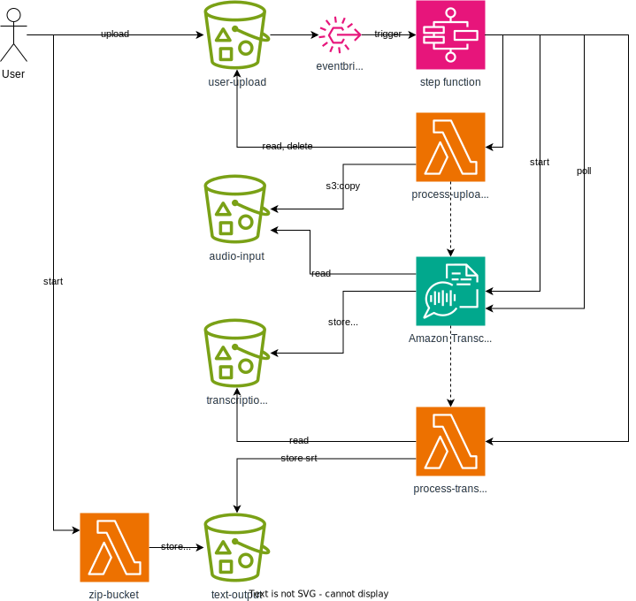

# Amazon Transcribe Demo CDK TypeScript project

## Architecture

## Requirements

* nodejs for the CDK
* your AWS account and profile setup for the CDK
* container runtime (docker) for bundling some lambda functions

## Setup

copy [config/account.template.ts](config/account.template.ts) to `config/account.ts` and adjust the values.

The `cdk.json` file tells the CDK Toolkit how to execute your app.

## Useful commands

bootstrap the CDK toolkit in your AWS account:
* `npx cdk bootstrap aws://ACCOUNT-NUMBER-1/REGION-1 --profile AWSPROFILE`

* `npx cdk synth`   emits the synthesized CloudFormation template
* `npx cdk diff`    compare deployed stack with current state
* `npx cdk deploy`  deploy this stack to your default AWS account/region

## Cleanup
Delete the Cloudformation stack in the AWS console or use `npx cdk destroy`

Manually delete:
- the `transcriber-dev-<accountid>-text-output` bucket

# User Guide

## Features

- You can upload a bunch of audio files to an S3 bucket, e.g. a whole folder.
- The folder structure is respected, the output will be in the same folder structure.
- Special characters and spaces are gracefully replaced with `_` underscores.
- You get the transcription as SRT files.
- There is a zipper lambda for your convenience.

## How to use
Upload files to the `transcriber-dev-<accountid>-user-upload` bucket.

The stepfunction will
- rename and move each file to the `transcriber-dev-<accountid>-audio-input` bucket
- start the transcription
- wait for the transcription to finish or fail
- process the transcription and save the result to the `transcriber-dev-<accountid>-text-output` bucket

The output will be srt files in the `transcriber-dev-<accountid>-text-output` bucket.
You can also use the `transcriber-dev-zip-bucket` lambda with a dummy event to zip the whole bucket (excluding .zip files).

## Retention

- The logs have a 3-months retention policy
- Most buckets have a 7-days retention policy
- The `transcriber-dev-<accountid>-text-output` bucket has a 30 days retention policy

## Limitations
- https://docs.aws.amazon.com/transcribe/latest/APIReference/API_StartTranscriptionJob.html
- 4-hour limit (Amazon Transcribe)
- `['mp3', 'mp4', 'wav', 'flac', 'ogg', 'amr', 'webm', 'm4a']`

## Prices
I have transcribed 1800 files worth 96 GB of audio (uploading that 100GB to S3, yes).
The majority of the costs are the transcription costs, 25000 minutes cost me cca. 400 USD in `eu-central-1`.
The 100 GB was single-digit Dollars.